# lab2
- [lab2](#lab2)
  - [搭建WEB服务器](#搭建web服务器)
  - [Wireshark捕捉交互过程](#wireshark捕捉交互过程)
    - [三次握手建立连接](#三次握手建立连接)
      - [第一次握手](#第一次握手)
      - [第二次握手](#第二次握手)
      - [第三次握手](#第三次握手)
    - [获取HTML页面](#获取html页面)
      - [客户端GET请求](#客户端get请求)
      - [服务器响应](#服务器响应)
      - [客户端确认](#客户端确认)
      - [服务器发送HTML文件](#服务器发送html文件)
      - [客户端确认接收](#客户端确认接收)
    - [请求解析资源](#请求解析资源)
      - [请求logo资源](#请求logo资源)
      - [请求音频资源](#请求音频资源)
    - [四次挥手](#四次挥手)
      - [第一次挥手](#第一次挥手)
      - [第二次挥手](#第二次挥手)
      - [第三次挥手](#第三次挥手)
      - [第四次挥手](#第四次挥手)
  - [思考](#思考)
    - [是否可以使用“两报文握手”建立连接？](#是否可以使用两报文握手建立连接)
    - [为什么要四次挥手？](#为什么要四次挥手)
    - [四次挥手发送最后一个确认报文后，为什么要等待2MSL后才进入关闭状态？](#四次挥手发送最后一个确认报文后为什么要等待2msl后才进入关闭状态)

## 搭建WEB服务器
本次使用python的flask包搭建服务器，将编写好的HTML文件以及相关资源文件放到对应目录，启动flask，即可完成服务器搭建。  
服务器的默认端口为5000，访问 http://127.0.0.1:5000 即可看到HTML页面。

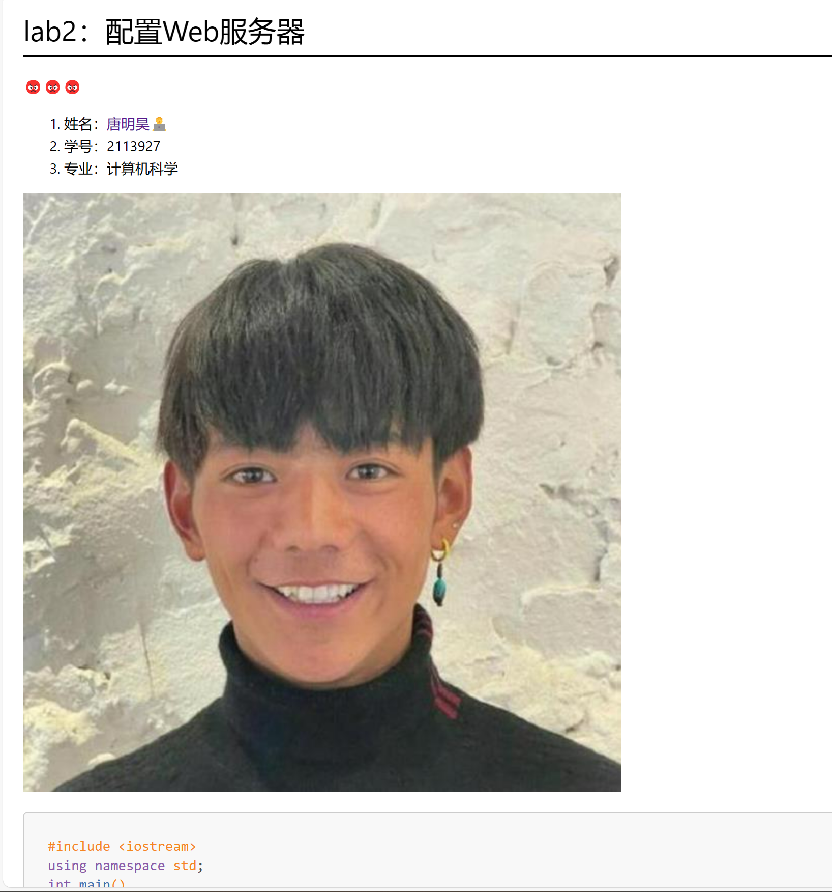

HTML页面的搭建是通过VSCode插件，将markdown文件转换为HTML文件生成。

## Wireshark捕捉交互过程
### 三次握手建立连接
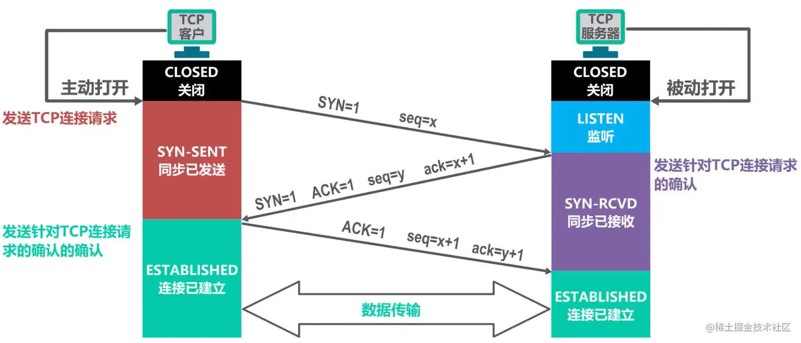

在浏览器打开网页 http://127.0.0.1:5000 跳转到编写的HTML页面，此时使用Wireshark可以捕捉到浏览器与服务器三次握手建立连接的过程，如下图所示：

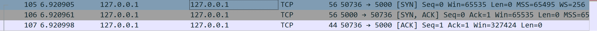

#### 第一次握手
浏览器主动与服务器建立连接，发送TCP请求，并等待服务器确认。  
采用回环测试，IP地址均为127.0.0.1，客户端（浏览器）端口号为50736，服务器端口号为5000。  

1. 同步位`SYN`置位，表示这条报文用于建立连接。
2. 序列号`Seq`为0，表示这是一个初始序列号。
3. 报文长度`Len`为0，表示这条报文只是建立连接，没有数据传输。
4. `Win`字段为65535，表示接收窗口大小目前为65535字节，下一次发送的数据不能大于该字段。
5. `MSS`为65459，表示最大报文段长度为65459字节（64KB）。
6. `WS`是窗口缩放选项，表示扩展窗口范围256倍（2^8）。
7. `SACK_PERM`表示允许选择重传机制。

#### 第二次握手
服务器接收到客户端发起的连接请求后，对SYN包进行确认并结束LISTEN阶段，为TCP连接分配资源，发送 SYN + ACK 包给客户端。  

1. 该TCP报文由服务器端口5000发送给客户端端口50736。
2. 标志位为`SYN`和`ACK`，表示确认客户端的报文 Seq 序号有效，服务器能正常接收客户端发送的数据，并同意创建新连接。
3. 自身的相对序号`Seq`为0；确认号`Ack`为1，表示服务器期望接收客户端下一个报文的序号为1（TCP规定SYN被设置为1的报文段虽不携带数据但要**消耗掉一个序号**）。

#### 第三次握手
客户端接收到发送的 SYN + ACK 包后，明确了从客户端到服务器的数据传输是正常的，为TCP连接分配资源，发送 ACK 包给服务器。

1. 标志位为`ACK`，表示确认服务器的报文 Seq 序号有效，客户端能正常接收服务器发送的数据。
2. 报文序号`Seq`为1，也即第二次握手中服务器期望接收客户端下一个报文的序号。
3. 确认号`Ack`为1，为服务器端序号`Seq`加1。
4. 此时窗口大小`Win`发生了变化，变为了1279*256=327424字节。

服务器端收到来自客户端确认收到服务器数据的报文后，得知从服务器到客户端的数据传输是正常的，三次握手完毕，双方进入ESTABLISHED状态，可以开始传输数据。

### 获取HTML页面
客户端通过HTTP的GET请求向服务器请求HTML页面，服务器收到请求后，将HTML页面作为响应报文发送给客户端。

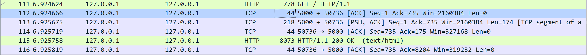

#### 客户端GET请求
首先客户端先发起一个HTTP的GET请求，查看相应报文：`Seq`=1，`ACK`=1，`Len`=734，因此该数据报文长度为734字节，从后面一次客户端发送报文`Seq`=735也可以看出。  
另外，Flags中设置了`PSH`，表示该报文是一个推送报文，接收方应该立即将该报文交给应用层。  

查看具体的报文内容，GET请求只有请求头，没有请求体。  

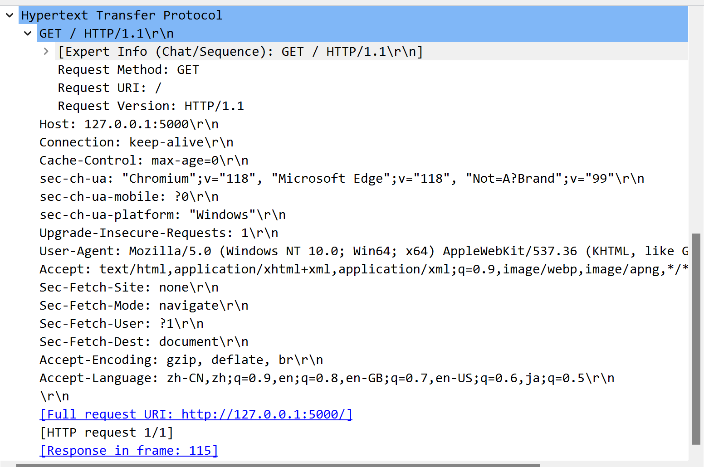

请求行由“请求方法”、“URL”和“协议版本”3个字段组成，具体的请求的附加信息放在请求头中。  
请求头中包含了`GET`协议方法；`Host`服务器地址；`Connection`连接方式，`keep-alive`表示保持连接；`User-Agent`之时服务器信息；`Accept`表示接收的数据类型；`Accept-Encoding`表示接收的数据压缩方式；`Accept-Language`表示接收的数据语言。

#### 服务器响应
服务器收到请求后，通过TCP回应一条确认报文，相对序号`Seq`为1，确认序号`Ack`为735，`Len`为0。  
紧接着，服务器还向客户端发送了一条带有[TCP segment of a reassembled PDU]标签的报文，意思是一个完整的TCP报文被拆分成了不同的段发送，需要进行重组。两条报文的`Ack`一致。  
第二条报文包含了HTTP响应信息，让客户端能够快速了解响应的基本信息，数据段长度为174。

#### 客户端确认
客户端收到响应报文后，紧接着向服务器发送确认报文，可以看到此时的`Seq`为735，`Ack`为175。  
另外，由于接收到了消息，客户端缓冲区容量按照TCP报文长度向上256取整后减少。由327424变为327168。

#### 服务器发送HTML文件
服务器收到客户端的确认报文以后，将HTML文件数据发送给客户端。  

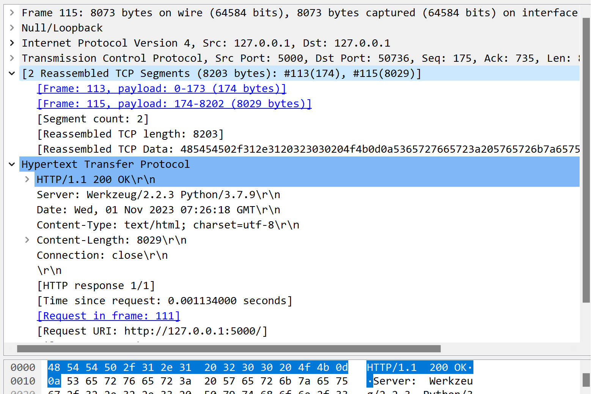

可以看到，`Seq`和`Ack`顺序变化；HTTP相应报文主要分为状态行，相应头和响应体：给出了HTTP版本号，响应状态码，提供谁在发送响应的额外信息，请求的数据等。

#### 客户端确认接收
最后，客户端收到了服务器的响应数据后，发送确认报文，`Seq`=175，`Ack`=175+8029=8204。

### 请求解析资源
#### 请求logo资源
在HTML网页中，引用了静态资源，因此浏览器会通过HTTP协议向服务器请求这些资源，如下图所示：

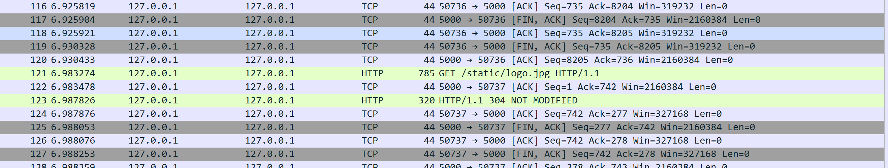

在请求logo.jpg之前，客户端和服务器建立了一个新的TCP连接，所以可以直接关闭获取HTML文件的50736端口的连接，使用50737端口进行资源请求。客户端多开一条TCP连接可能是用来减轻**拥塞**的影响，用单独的TCP连接来获取logo.jpg资源。  

而由图可以看到，在发送GET请求后，服务器并没有传输大量数据，而是返回了一个304 NOT MODIFIED的状态码。原因是在抓包之前还通过浏览器与服务器有过交互，此时浏览器由缓存的副本，所以服务器通知客户端资源并未修改，无需重新下载。

#### 请求音频资源
在对音频文件进行请求时，同样新建了一条TCP连接，使用端口号50738。  
接着服务器开始向客户端传输数据。通过对抓包数据进行分析，服务器将整个文件分为多个数据包进行发送。客户端接收到一个完整的TCP报文后向服务器发送`ACK`确认报文，由于确认报文长度为0，所以`Seq`值一直不变，而缓冲区`Win`逐渐变小。

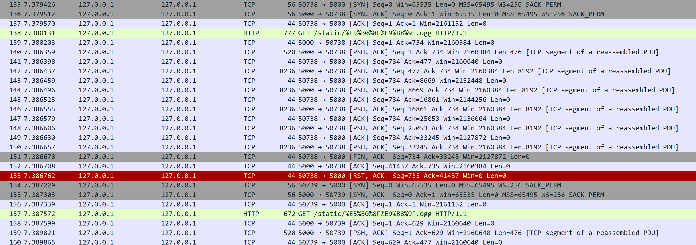

但在后面可以看到，客户端遇到了异常情况，突然向服务器发送了一个RST+ACK包，希望强制终止连接。  
接着客户端在端口50739重新与服务器建立TCP连接，并重新发送GET请求。 

在新开辟的TCP连接上，客户端与服务器进行数据通信，传输了累积343633字节的数据。  

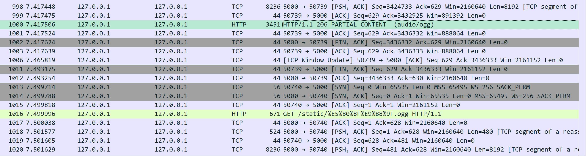

最后服务器端向客户端发送206 PARTIAL CONTENT状态码，表示请求数据的部分内容发送完毕。后续断开该TCP连接，又进行开辟新的TCP连接，继续传输数据。从flask的控制台输出也可以看出需要两次GET请求才能完整获取音频文件。

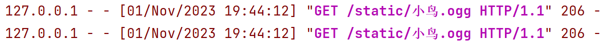

### 四次挥手
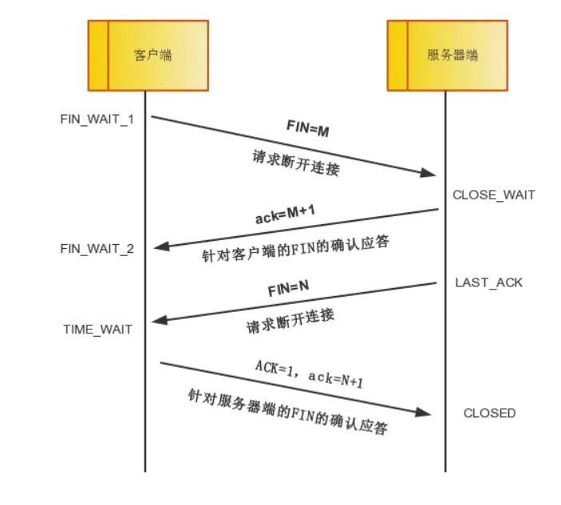

在完成通信后，客户端会主动和服务器断开TCP连接，释放占用的资源。  
下图是服务器已经完成了HTML文件的数据传输，不再需要该连接，因此服务器主动发送FIN来关闭连接。

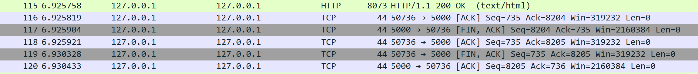

#### 第一次挥手
在完成数据传输后，服务器请求断开连接。第一次挥手，服务器向客户端发送FIN+ACK报文，随后进入FIN_WAIT_1阶段，等待客户端接收报文后的响应报文。  
`Seq`和`Ack`字段与上一条分组相关字段相对应。

#### 第二次挥手
客户端接收到服务器的断开连接请求后，结束ESTABLISHED阶段，进入CLOSE_WAIT阶段，发送ACK确认报文。  
`Seq`字段即为第一次挥手的`Ack`值，`Ack`字段为第一次握手的`Seq`+1。因为TCP规定终止位FIN等于1的报文段即使不携带数据，**也要消耗掉一个序号**。

#### 第三次挥手
接着，客户端做好断开连接准备后，向服务器发送FIN+ACK报文，其中`Seq`和`Ack`字段与第二次挥手中的值保持一致。  
客户端进入LAST_ACK阶段，停止向服务器发送数据，等待针对FIN的确认应答。

#### 第四次挥手
服务器接收到客户端断开连接请求后，确认客户端已经做好释放连接准备，进入TIME_WAIT阶段，回复一条`ACK`确认报文。  
客户端接收到`ACK`报文后，进入CLOSED阶段，正式关闭连接。服务器在等待2MSL后，也进入CLOSED阶段。

## 思考
### 是否可以使用“两报文握手”建立连接？
三次握手的主要目的是确认自己和对方的发送和接收都是正常的，从而保证了双方能够进行可靠通信。  
若采用两次握手，当第二次握手后就建立连接的话，此时客户端知道服务器能够正常接收到自己发送的数据，而服务器并不知道客户端是否能够收到自己发送的数据。  
具体来说，两次握手情况下，如果在TCP断开后，存在冗余失效的TCP连接请求到达TCP服务器进程，TCP服务器还会误认为这是TCP客户端又发起了一个新的TCP连接请求，会发送确认报文并进入连接。但客户端并不会响应，这会浪费服务器资源。

### 为什么要四次挥手？
释放TCP连接时之所以需要四次挥手，是因为FIN释放连接报文和ACK确认接收报文是分别在两次挥手中传输的。  
当主动方在数据传送结束后发出连接释放的通知，由于被动方可能还有必要的数据要处理，所以会先返回ACK确认收到报文。当被动方也没有数据再发送的时候，则发出连接释放通知，对方确认后才完全关闭TCP连接。

### 四次挥手发送最后一个确认报文后，为什么要等待2MSL后才进入关闭状态？
如果客户端发送了最后的确认报文段直接关闭的话，如果该确认报文段丢失了，会导致处于LAST_ACK状态的服务器不断重传FIN报文段，而客户端已经关闭不会响应，服务器就会一直等待下去，浪费资源。  
因此时间等待状态以及处于该状态2MSL时长，可以确保TCP服务器收到最后一个TCP确认报文段而进入关闭状态。  
另外，2MSL的时长可以使本次连接内产生的所有报文段都从网络中消失，使得下一个TCP连接中，不会出现旧连接中的报文段。
