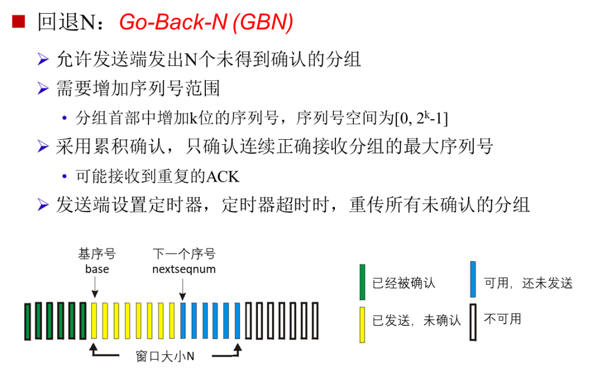
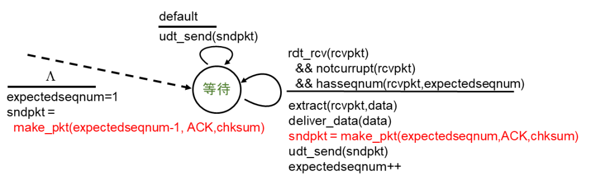
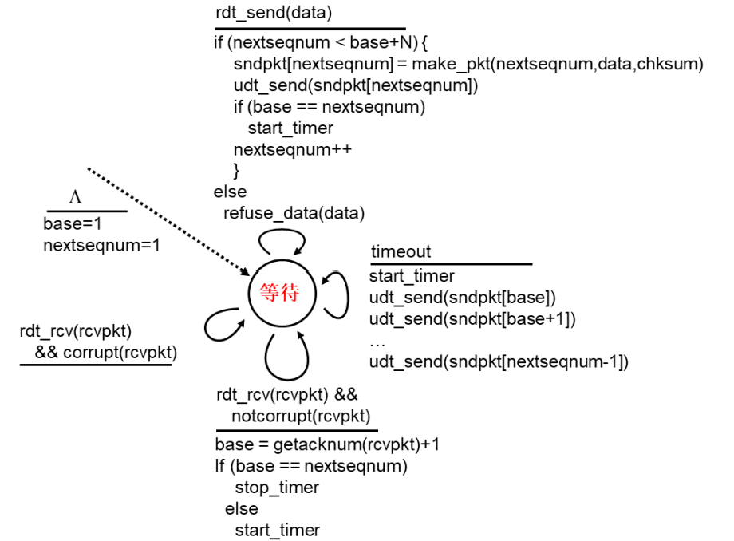
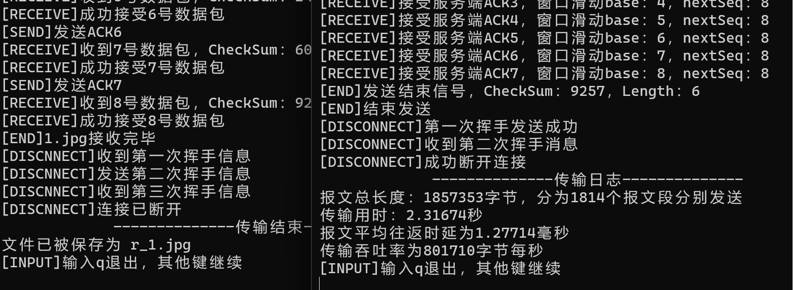
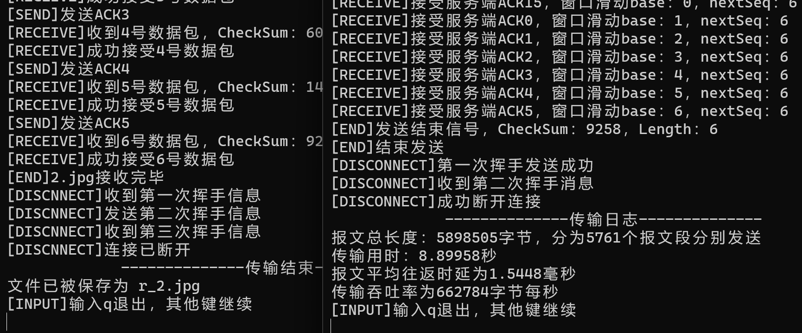
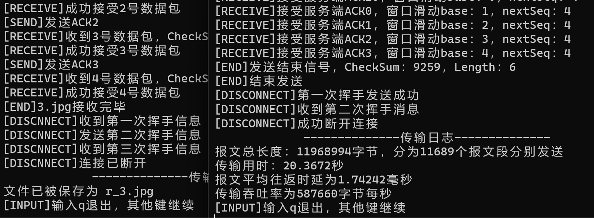
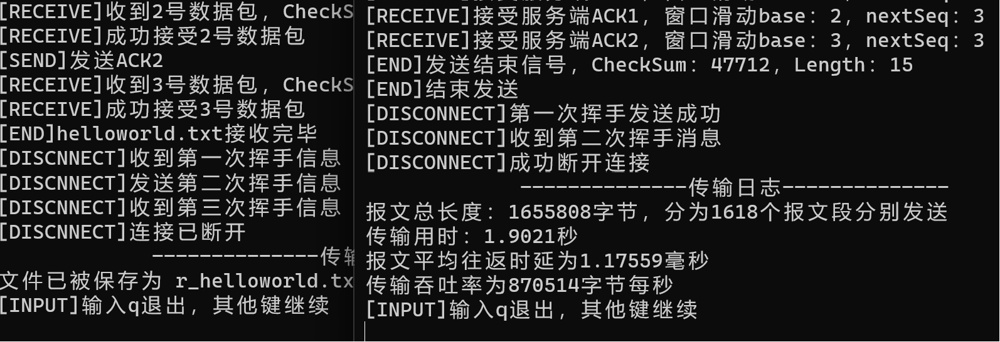
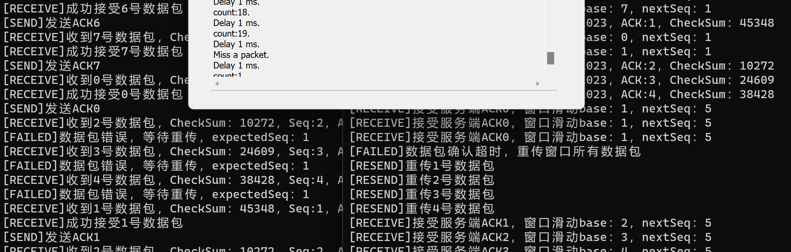

# lab3-2：基于UDP的可靠传输协议--GBN
- [lab3-2：基于UDP的可靠传输协议--GBN](#lab3-2基于udp的可靠传输协议--gbn)
  - [实验设计](#实验设计)
  - [具体实现](#具体实现)
    - [接收端](#接收端)
    - [发送端](#发送端)
  - [运行结果](#运行结果)
  - [实验总结](#实验总结)
    - [序号大小与窗口大小的思考](#序号大小与窗口大小的思考)
    - [多线程的思考](#多线程的思考)

## 实验设计
本次实验在lab3-1的基础上进行改进，将停等协议改成了基于滑动窗口的流量控制机制（GBN）。  
程序执行流程与上次大体一致，Server与Client之间的通信借助Router进行转发，通过Router调节丢包率和延时：
1. Client端发送连接请求，Server端接收连接请求，三次握手建立连接。
2. Client端载入文件，分组发送数据报；Server端接收数据报，发送确认数据报。
3. Client端将文件名同文件传输结束数据报一起发送；Server端接收文件名，发送确认数据报，保存文件。
4. Client端发送断开连接请求，Server端接收断开连接请求，三次挥手断开连接。
5. 接收用户输入，是否进行下一轮传输。

上次实验设计的数据报头格式中，`seq`字段和`ack`字段均为`ushort`类型，因此在本次实验中，能够继续复用上次实验的数据报设计。  

<center>

| **0-15** | **16-31**  | **32-47** |
|:--------:|:----------:|:---------:|
| CheckSum | Seq        | Ack       |
| Flag     | Length     | SourcePort|
| DesPort  | Data       | Data      |

</center>

本次实验中，`seq`字段只对发送方有意义，用于标识发送的数据报的序号；`ack`字段只对接收方有意义，用于标识接收到的数据报的序号。  
其余字段的具体含义与上次实验相同，这里不再赘述。


## 具体实现
本次实验主要部分在于GBN协议的实现：在停等的基础上增加**流水线机制**，通过更大的序号范围/**缓存**，允许发送方在收到ACK之前发送多个分组，提高资源利用率。 

为了维持**可靠传输**的特性，GBN协议维护滑动窗口，只能发送窗口内的分组，以便超时后进行重传。  

GBN支持**累积确认**，发送方收到一个分组确认后，就知道这个确认之前的所有分组都已经被正确接收，可以将滑动窗直接移动到该确认的分组后。  
这意味着，即使某个分组N的`ACK`丢失，在收到分组N+1的`ACK`后，发送方也能知道分组N已经被正确接收，从而不必重传分组N。  
<center>

</center>

### 接收端
首先看接收端，GBN接收端要做的事很少，只需要维护**下一个期望接收的分组序号**`expectedSeq`。
1. 如果接收到的分组序号与`expectedSeq`相同，说明这是期望的按序接收的分组，将`expectedSeq`加一，将分组写入文件，发送`ACK`。
2. 其他情况，无论是分组失序、分组重复、分组错误，都直接丢弃收到的分组，然后重传上次发送的`ACK`，即正确接收的最高序号分组。

<center>

</center>

代码实现上，参照状态机进行实现：  
- 将套接字设置为非阻塞，循环提取数据报，检查校验和与序列号，如果不正确则丢弃并重传`ACK`。否则则包装并发送分组确认。
- 收到正确数据报时，还需要进行一个数据报`flag`位的确认，如果为`OVER`则认为是文件传输结束信号，进入结束传输函数。
- 另外为了交互性，设置了定时器：若长时间未收到报文，则认为连接出现错误。

```C++
    // 接受数据
    while (true) {
        // 等待接收数据
        int getData = recvfrom(server, recvbuffer, sizeof(header) + MAX_DATA_LENGTH, 0, (sockaddr*)&router_addr, &rlen);
        if(getData > 0){
            // 重置时钟，输出日志
            ...
            // 检验数据包是否正确
            if(header.seq == expectedSeq && check((u_short*)recvbuffer,sizeof(header)+MAX_DATA_LENGTH)==0){  // 数据包正确
                cout << "[RECEIVE]成功接受"<<expectedSeq<<"号数据包" << endl;
                if(header.flag == OVER)
                    // 收到结束发送信号，提取发送的文件名，进入endReceive
                    ...
                // 正确接收expectedSeq号数据包
                memcpy(message + mPointer, recvbuffer + sizeof(header), header.length);
                mPointer += header.length;
            }
            else{  // 数据包错误/冗余，重传上一次ACK
                cout << "[FAILED]数据包错误，等待重传，expectedSeq：" << expectedSeq << endl;
                ...
                continue;
            }
            // 发送ACK
            setHeader(header,ACK,expectedSeq,expectedSeq,0);
            memcpy(sendbuffer, &header, sizeof(header));
            if (sendto(server, sendbuffer, sizeof(header), 0, (sockaddr*)&router_addr, rlen) == SOCKET_ERROR) {
                cout << "[FAILED]ACK发送失败" << endl;
                return -1;
            }
            cout << "[SEND]发送ACK" << expectedSeq << endl;
            sendACK = true;
        }
        // 长时间未收到数据，认为链接中断
        ...
        if(sendACK){
            // 转变序号
            expectedSeq++;
            if(expectedSeq == SEQ_SIZE)
                expectedSeq = 0;     
        }
    }
```

### 发送端
发送端需要处理的事件较多，需要维护**发送窗口**`sendbuffer`，**下一个待发送的分组序号**`nextSeq`，**基序号**`base`，**计时器**`start`等。根据状态机进行总结：  
1. 发送：收到一个发送请求后，需要判断分组序号`nextSeq`是否在窗口内，若不在则等待窗口滑动；否则发送数据报，根据`base`设置计时器，调整`nextSeq`。
2. 接收：收到一个`ACK`后，采取**累积确认**，将`base`设置为`ACK`的序号加一。若`base`等于`nextSeq`，说明窗口内所有分组都已经被确认，停止计时器；否则，重置计时器。
3. 超时：发生计时器超时，**“回退N步”**，重传窗口内所有分组，重置计时器。
4. 其余情况，不做任何处理。

<center>

</center>

代码实现上，使用多线程与循环，不断检查**发送、接收、超时**三个事件。整体逻辑与状态机是一致的，下面介绍一些代码上的细节。  

接收事件在`threadRecv`线程进行，不断获取`ACK`。如果是一个正确的`ACK`报文，则根据`ACK`的序号调整`base`，同时设置定时器，这个过程需要**用到互斥锁来保证一致性**。  
`ThreadRecv`线程通过全局变量`exitThread`控制，当文件传输结束时，`exitThread`置为`true`，`ThreadRecv`线程退出。
```C++
    while(!exitThread){
        // -----接收事件-----
        int getData = recvfrom(client, recvbuffer, sizeof(header), 0, (sockaddr*)&router_addr, &rlen);
        if(getData > 0){
            // 检查ACK
            memcpy(&header, recvbuffer, sizeof(header));
            if (header.flag == ACK && check((u_short*)&header, sizeof(header) == 0)) {
                mtx.lock();
                base = header.ack + 1;  // 累积确认
                // 日志输出；设置定时器；调整base窗口
                ...
                mtx.unlock();                    
            }
            // 数据包错误什么也不做
        }
    }
```

超时事件在`ThreadTimer`中进行，循环进行检查，如果发生超时，**重传窗口内所有分组**，重置计时器。  
同样使用`exitThread`控制线程退出，在开始重传时，需要使用互斥锁拿到`base`和`nextSeq`的值，保证一致性，避免过程中被修改。  
```C++
    while(!exitThread){
        if (startFlag && (clock() - start > MAX_TIME*2)) {
            cout<<"[FAILED]数据包确认超时，重传窗口所有数据包"<<endl;
            // 确认窗口范围
            mtx.lock();
            int temp_Seq = nextSeq;
            int temp_base = base;
            int temp = temp_Seq;
            mtx.unlock();
            // 重传窗口内所有数据包
            ...
            // 重置计时器
            mtx.lock();
            start = clock();
            startFlag = true;
            mtx.unlock();
        }
    }
```

发送事件在主线程中进行，循环进行检查，如果`nextSeq`在窗口内，则发送数据报，设置计时器，调整`nextSeq`。  
同样的，为了**保证一致性**，需要使用互斥锁拿到窗口范围。  
在文件传输完毕，主线程会等待窗口所有分组被确认后，设置`exitThread`关闭另外两个线程，然后进入结束传输函数。
```C++
    while (true) {
        // 确认窗口范围
        mtx.lock();
        if (nextSeq < base)
            temp = nextSeq + SEQ_SIZE;
        int window_bound = base + WINDOW_SIZE;
        mtx.unlock();
        // -----发送事件-----
        if(temp < window_bound){  // 可以发送数据
            if (mPointer >= fileLength) {  // 发送完毕
                // 确定窗口都已经确认，结束发送
                if(base == nextSeq){
                    // 设置exitThread为true，通知ThreadRecv函数退出；进入endSend发送结束信号
                    ...
                }
                // 窗口内未确认完毕，继续等待确认
            }
            else{
                // 封装数据包
                ...
                // 发送数据包，补满数据包一起发送
                ...
                mtx.lock();
                // 如果是第一个数据包，设置计时器
                ...
                // 转变序号
                ...
                mtx.unlock();
            }
        }
    }
```

值得一提的是，本次实验中，将序号范围设置为窗口大小的两倍，即`SEQ_SIZE = WINDOW_SIZE * 2`。在判断分组序号是否在窗口内、重传窗口内所有数据包时，需要格外注意序号范围的变化。

## 运行结果
滑动窗大小设置为8，对给定的测试文件进行测试，结果如下：
<center>
<table>
  <tr>
    <td></td>
    <td></td>
  </tr>
  <tr>
    <td></td>
    <td></td>
  </tr>
</table>
</center>

文件传输正常，最终结果与原文件一致。  
测试使用Router调节丢包率和延时，可以正确进行超时重传，结果如下：
<center>

</center>


## 实验总结
### 序号大小与窗口大小的思考
<!-- 序号大小和窗口大小的关系 -->

### 多线程的思考
<!-- 全局变量一致性，事件中途打断的影响 -->