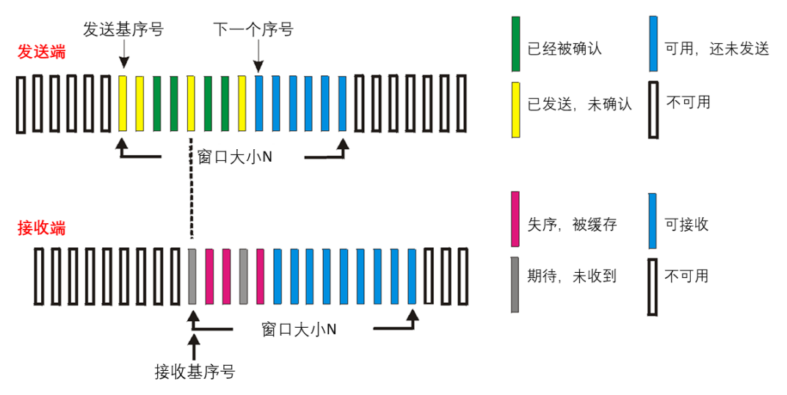
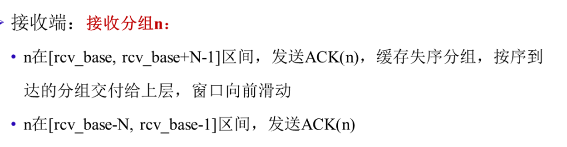
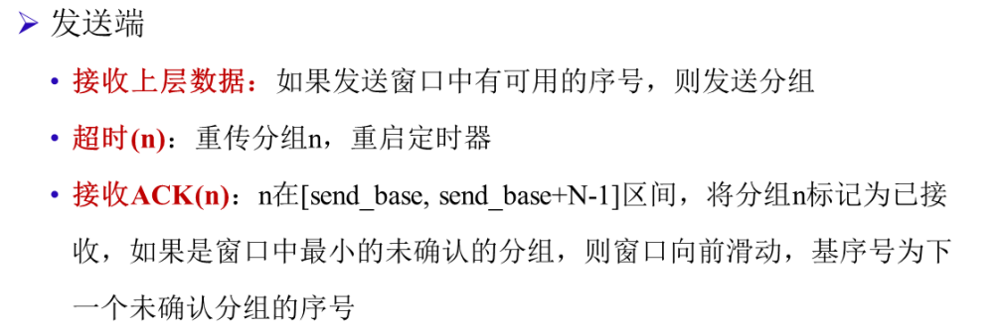
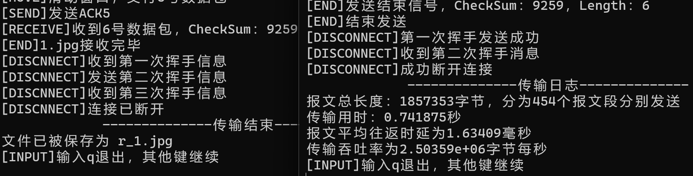
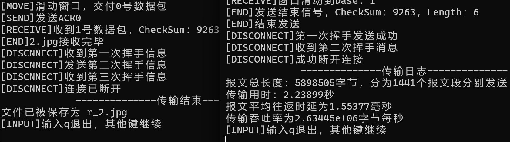
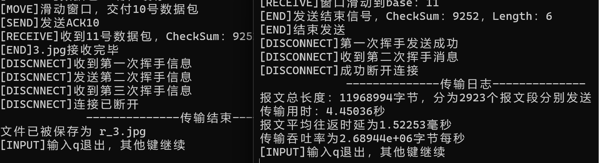
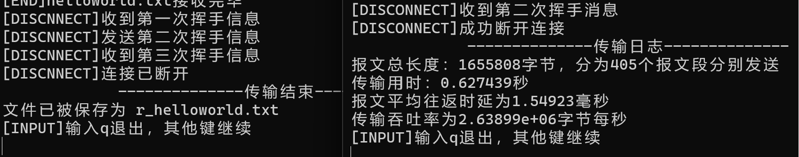
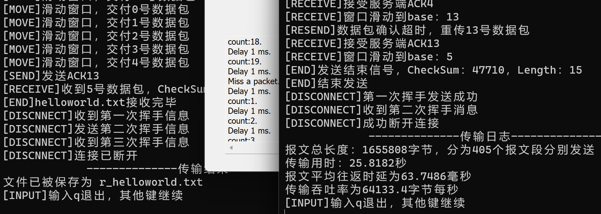

# lab3-3：基于UDP的可靠传输协议--SR
- [lab3-3：基于UDP的可靠传输协议--SR](#lab3-3基于udp的可靠传输协议--sr)
  - [实验设计](#实验设计)
  - [具体实现](#具体实现)
    - [接收端](#接收端)
    - [发送端](#发送端)
  - [运行结果](#运行结果)
  - [实验总结](#实验总结)
    - [接收端确认的问题](#接收端确认的问题)


## 实验设计
本次实验在lab3-1的基础上进行改进，将停等协议改成了选择重传协议（SR）。  
程序执行流程与前面实验一致，Server与Client之间的通信借助Router进行转发，通过Router调节丢包率和延时：
1. Client端发送连接请求，Server端接收连接请求，三次握手建立连接。
2. Client端载入文件，分组发送数据报；Server端接收数据报，发送确认数据报。
3. Client端将文件名同文件传输结束数据报一起发送；Server端接收文件名，发送确认数据报，保存文件。
4. Client端发送断开连接请求，Server端接收断开连接请求，三次挥手断开连接。
5. 接收用户输入，是否进行下一轮传输。

数据报设计同前保持一致，`seq`字段只对发送方有意义，用于标识发送的数据报的序号；`ack`字段只对接收方有意义，用于标识接收到的数据报的序号。

<center>

| **0-15** | **16-31**  | **32-47** |
|:--------:|:----------:|:---------:|
| CheckSum | Seq        | Ack       |
| Flag     | Length     | SourcePort|
| DesPort  | Data       | Data      |

</center>

## 具体实现
GBN协议潜在地允许发送方用多个分组填充流水线，避免了停等协议的低信道利用率的问题。但GBN也存在一定性能问题，尤其当窗口长度很长和带宽时延积很大时，**单个分组的差错就能够引起GBN重传大量分组，而其中部分分组根本没必要重传**。  

选择重传(SR)协议通过**让发送方仅重传那些它怀疑在接收方出错的分组**，从而避免不必要的重传。这种个别的、按需的重传要求接收方逐个地确认正确接收的分组。  
与GBN类似的，SR协议也要求发送方维护一个窗口来限制流水线中未完成的分组数。但是与之不同的，SR可能已经收到了对窗口中某些分组的确认。  
<center>

</center>

### 接收端
SR的接收端要做的事比GBN多一些，需要维护一个**接收窗口**，并对接收到的分组n进行检查，**缓存失序的分组**。  
当分组以及以前缓存的分组构成**连续的序号**时，及时将分组交付给上层并滑动窗口。  

<center>

</center>

具体的代码实现如下：  
- 将套接字设置为非阻塞，循环提取数据报，检查校验和，如果不正确则丢弃。
- 收到正确数据报时，判断是否在接收窗口内，如果在则缓存，并检查是否可以滑动窗口。
- 实验将序号范围设置为2倍窗口大小，**因此收到任意分组都可以发送ACK确认，符合SR协议**。
- 为了交互性，设置了定时器：若长时间未收到报文，则认为连接出现错误。

```C++
    // 接受数据
    while (true) {
        // 等待接收数据
        int getData = recvfrom(server, recvbuffer, sizeof(header) + MAX_DATA_LENGTH, 0, (sockaddr*)&router_addr, &rlen);
        if(getData > 0){
            // 重置时钟，输出日志
            ...
            // 检验数据包是否正确
            if(check((u_short*)recvbuffer,sizeof(header)+MAX_DATA_LENGTH)==0){  // 数据包正确 
                if(header.flag == OVER){
                    // 收到结束发送信号，提取发送的文件名，进入endReceive
                    ...
                }
                // 确认序号范围
                ...
                if(temp >= rcvBase && temp <= rcvBase + WINDOW_SIZE -1 && isRecv[header.seq] == false){
                    // 在接收窗口内，需要缓存失序分组/滑动窗口
                    isRecv[header.seq] = true;
                    memcpy(winBuffer[header.seq], recvbuffer, sizeof(header) + MAX_DATA_LENGTH);
                    if(header.seq == rcvBase)
                        // 滑动窗口
                        moveWindow();
                }
                // 发送ACK，seqSize=2*winSize，肯定可以发
                setHeader(header,ACK,header.seq,header.seq,0);
                memcpy(sendbuffer, &header, sizeof(header));
                ...
            }
        }
        // 长时间未收到数据，认为链接中断
        ...   
    }
```

### 发送端
发送端除了需要维护**发送窗口**外，还需要为每个分组设置一个**定时器**，用于超时重传；另外，还需要记录窗口内每个分组的**接收状态**，用于判断是否需要重传。  
总结下来仍然是三个事件：
1. 超时重传：当某个分组的定时器超时时，重传该分组。
2. 接收ACK：当收到ACK时，更新窗口内分组的接收状态，如果分组是窗口最小序号的分组，则滑动窗口。
3. 发送分组：当窗口内有可用的分组序号时，发送分组。

<center>

</center>

采用**多线程**处理三个不同的事件，具体代码实现如下：

接收事件在`threadRecv`线程进行，不断获取`ACK`。  
如果是一个正确的`ACK`报文，则标记对应的分组已接收，若分组恰是窗口下界，还需要向前滑动窗口。  
以上过程都需要**用到互斥锁来保证一致性**。  
`ThreadRecv`线程通过全局变量`exitThread`控制，当文件传输结束时，`exitThread`置为`true`，`ThreadRecv`线程退出。
```C++
    while(!exitThread){
        int getData = recvfrom(client, recvbuffer, sizeof(header), 0, (sockaddr*)&router_addr, &rlen);
        if(getData > 0){
            // 检查ACK
            memcpy(&header, recvbuffer, sizeof(header));
            if (header.flag == ACK && check((u_short*)&header, sizeof(header) == 0)) {
                // 判断ACK是否在窗口内
                ...
                if(!(temp>=base && base<=temp+WINDOW_SIZE-1))  // 不在窗口内，丢弃
                    continue;
                    
                cout << "[RECEIVE]接受服务端ACK" << header.ack << endl;
                mtx.lock();
                startFlag[header.ack] = false;  // 确认收到ACK，关闭计时器
                if(header.ack == base){  // 窗口滑动
                    ...
                }
                mtx.unlock();                    
            }
        }
    }
```

超时事件在`ThreadTimer`中进行，循环检查窗口内分组的定时器，如果发生超时，**重传该分组**。  
同样使用`exitThread`控制线程退出，在读取/修改全局变量时，需要使用互斥锁保证一致性，避免过程中被修改，导致程序死锁。
```C++
    while(!exitThread){
        ...
        for(int j=0;j<WINDOW_SIZE;j++){  // 遍历窗口内每个计时器
            int seq = (tempBase + j)%SEQ_SIZE;
            mtx.lock();
            bool flag = startFlag[seq];
            mtx.unlock();
            if (flag && (clock() - start[seq] > MAX_TIME*2)) {
                // 重传超时分组
                ...
                // 重置计时器
                mtx.lock();
                start[seq] = clock();
                mtx.unlock();
            }
        }
    }
```

发送事件在主线程中进行，循环进行检查，如果`nextSeq`在窗口内，则发送数据报，为该分组设置计时器，调整`nextSeq`。  
同样的，为了**保证一致性**，需要使用互斥锁拿到窗口范围以及更改全局时钟和确认标志。  
文件传输完毕后，主线程会等待窗口所有分组被确认后，设置`exitThread`关闭另外两个线程，然后进入结束传输函数。
```C++
    while (true) {
        // 使用互斥锁确认窗口范围
        ...
        if(temp < window_bound){  // 可以发送数据
            if (mPointer >= fileLength) {  // 文件发送完毕
                // 确定窗口都已经确认，结束发送
                if(base == nextSeq){
                    // 设置exitThread为true，通知ThreadRecv函数退出
                    exitThread = true;
                    // 清空缓冲区
                    ...
                    // 进入endSend()，结束文件传输
                    ...
                }
                // 窗口内未确认完毕，继续等待确认
            }
            else{
                // 封装数据包
                ...
                // 发送数据包，补满数据包一起发送
                ...
                mtx.lock();
                // 设置分组nextSeq的计时器
                startFlag[nextSeq] = true;
                start[nextSeq] = clock();
                // 转变序号
                nextSeq++;
                if(nextSeq == SEQ_SIZE)
                    nextSeq = 0;
                mtx.unlock();
            }
        }
    }
```

实验中，将序号范围设置为窗口大小的两倍，即`SEQ_SIZE = WINDOW_SIZE * 2`。在判断分组序号是否在窗口内、滑动窗口时，需要格外注意序号范围的变化。

## 运行结果
滑动窗大小设置为8，对给定的测试文件进行测试，结果如下：
<center>
<table>
  <tr>
    <td></td>
    <td></td>
  </tr>
  <tr>
    <td></td>
    <td></td>
  </tr>
</table>
</center>

文件传输正常，最终结果与原文件一致。  
测试使用Router调节丢包率和延时，结果如下：
<center>

</center>

可以看到server端接收到了除13号数据包以外的其他数据包，client端相应地完成了确认。  
而13号数据包由于丢包未确认，所以**窗口卡在13号数据包**。  
当发生超时事件，client端重传13号数据包，收到server端的确认后，**发送窗口直接滑动到了5号数据包**，继续进行传输。

## 实验总结
### 接收端确认的问题
- SR协议的接收端为什么收到序号在 [rcv_base-N, rcv_base-1] 内的分组时，也要产生一个`ACK`，即使该分组是接收方以前确认过的分组？  
这是考虑到`ACK`数据包可能丢失的情况：  
当接收端发送了`send_base`的`ACK`后，窗口向前滑动；此后如果`ACK`数据包丢失，发送端会进行超时重传。  
接收端收到重传的分组，但是此时接收端已经确认过该分组，如果不发送`ACK`，发送端会一直重传该分组，**导致发送方窗口将永远不能向前滑动**。

- 为何SR协议在收到序号在 rcv_base-N-1之前的分组时，选择直接丢弃，不产生`ACK`？ 
SR协议的接收端只有在收到序号在 [rcv_base, rcv_base+N-1] 内的分组时，才会将窗口向前滑动。移动到rcv_base时，rcv_base-1一定已经确认过了。  
发送端之所以能够发送rcv_base-1，一定是因为该序号在窗口内，而窗口大小为N，所以发送端一定已经收到了rcv_base-N-1的`ACK`。
