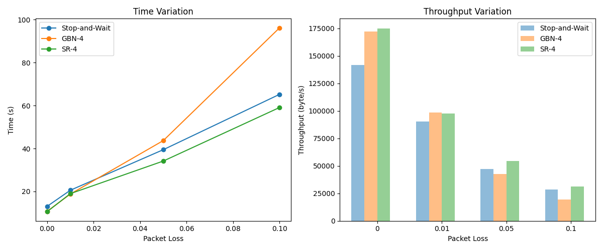
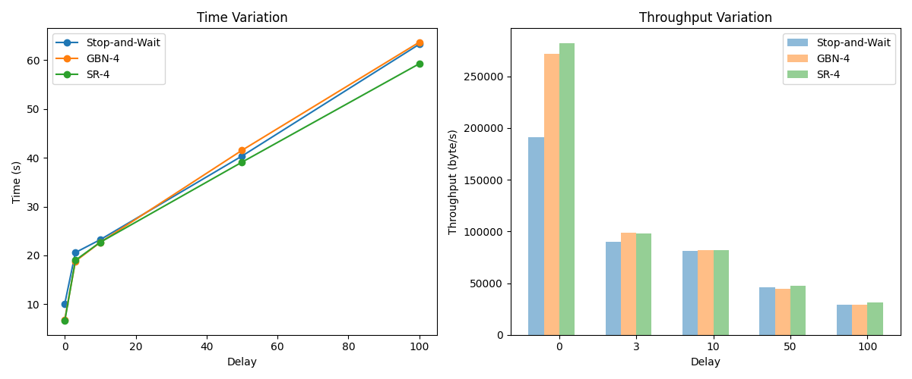
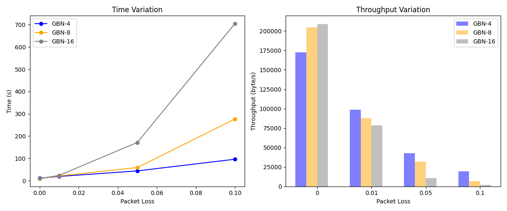
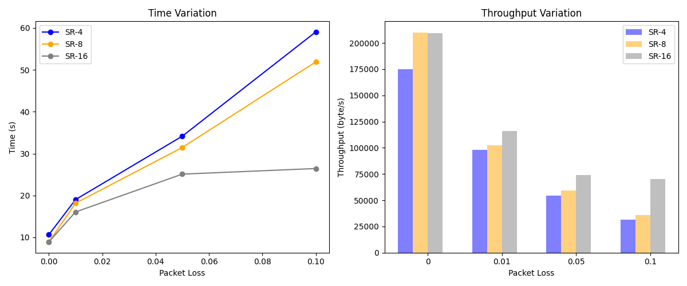

# lab3-4：基于UDP的可靠传输协议性能比较
- [lab3-4：基于UDP的可靠传输协议性能比较](#lab3-4基于udp的可靠传输协议性能比较)
  - [实验设置](#实验设置)
  - [停等机制与滑动窗口机制性能对比](#停等机制与滑动窗口机制性能对比)
    - [控制时延](#控制时延)
    - [控制丢包率](#控制丢包率)
  - [滑动窗口机制中不同窗口大小对性能的影响](#滑动窗口机制中不同窗口大小对性能的影响)
    - [GBN](#gbn)
    - [SR](#sr)
  - [累计确认和选择确认的性能比较](#累计确认和选择确认的性能比较)


## 实验设置
本次实验在已经完成3个版本的基于UDP的可靠传输协议基础上，通过调节丢包率和延时等参数获得不同的传输数据以对三者进行比较分析。    
为了保证实验比较的相对公平性，三个协议数据包格式相同，另外数据包大小与重传延时也设置相同：  
```C++
// 最大数据长度 --用于封装单个数据包
const unsigned short MAX_DATA_LENGTH = 0x1000;
// 最大传输延迟时间 --用于超时重传时间
const int MAX_TIME = 0.5*CLOCKS_PER_SEC;
```

以`1.jpg`做为测试文件，该文件大小为1857353字节，用上文提到的数据包格式封装，共计454个数据包。

## 停等机制与滑动窗口机制性能对比
在该部分，通过调整丢包率和延时，对比停等机制和滑动窗口机制的性能，滑动窗口机制中窗口大小统一设置为4。  
观察得到，`router`程序对延时的处理不够稳定，在使用其数据对比前，先展示将丢包率和延时设置为0时的结果：  
|                 | 停等         | GBN-4      | SR-4        |
|:---------------:|:----------:|:----------:|:-----------:|
| 传输用时 (s)        | 0.78       | 0.56       | 0.62        |
| 报文平均往返时延 (ms)   | 1.72       | 1.25       | 1.37        |
| 传输吞吐率 (byte/s)  | 2371898.41 | 3264929.34 | 2969883.08  |

可以看到，在**网络通畅**时，**滑动窗口机制的性能绝对优于停等机制**，但是在网络不稳定时，滑动窗口机制的性能就会因为重传，线程同步等开销而下降。  

### 控制时延
设置`router`程序的延时为3ms，不断调整丢包率，可得到如下图所示结果：  
<center>

</center>

如图可以看到：  
- 初始丢包率较小时，滑动窗口机制的性能优于停等机制。因为滑动窗口利用**流水线**的方式，可以在等待确认的同时发送新的数据，而停等机制则需要停止等待，不能充分利用带宽。
- 随着丢包率的增加，**GBN的性能下降很快**，最后甚至远低于停等机制。这是因为GBN陷入了**不断重传**而失去了流水线的优势。
- 另一方面，SR的性能依然保持在一个较高的水平，这是因为SR可以**选择性重传**，只重传丢失的数据包，**不会比停等机制多重传数据**。
  
需要注意的是，当陷入重传时，滑动窗的性能除了因为重传开销而下降，还会因为多线程维护全局窗口缓存的**线程同步开销**（**各种锁机制**）而下降。


### 控制丢包率
设置`router`程序的丢包率为1%，不断调整延时，可得到如下图所示结果：
<center>

</center>

- 不设置`router`延时时，滑动窗口的性能大幅优于停等机制，原因通前述一致，滑动窗利用流水线的方式充分利用了带宽。
- 设置延时后，滑动窗的性能与停等机制一样开始不断下降，但与停等相比，仍然能够保持**微弱的领先**。
- 虽然图中表现不明显，但如果延时设置过大，也会**导致滑动窗陷入不断重传的状态**，性能会急剧下降。特别是在窗口更大的情况下，处理时线程同步开销更大，更容易陷入大量重传状态。


## 滑动窗口机制中不同窗口大小对性能的影响
下面比较滑动窗口机制中不同窗口大小对性能的影响，分别比较GBN和SR两种协议。  
控制`router`延时为3ms，调节丢包率，比较不同窗口大小下的性能。  
没有采取控制丢包率而调整延时的方式，是因为滑动窗的等待时延设置不够合理，以及`router`程序时延不够稳定，会导致延时过大时程序大量重传，不具有很好的比较性。

### GBN
GBN不同窗口大小在不同丢包率下的性能对比如下图所示：
<center>

</center>

- 当丢包率较小时，窗口越大，性能越好。这是因为窗口越大，**越能充分利用带宽**，反之则会因为等待确认而浪费一定带宽。
- 但当丢包率较大时，窗口越大，性能越差。因为GBN只要有一个数据包丢失，就会导致窗口内的所有数据包都需要重传，窗口越大，**重传开销就越大**。
- 重传开销不只是发送数据包的开销，还有**线程同步开销**，会有**更多的锁竞争**，导致性能下降更快。

### SR
SR不同窗口大小在不同丢包率下的性能对比如下图所示：
<center>

</center>

- 可以看到，SR的性能随着窗口越大而越好，除了因为**更充分利用带宽外**，还因为**选择性重传**，不会重传已经确认的数据包，进而**重传开销小**。
- 另外，由图可以看出，在丢包率很大时，大窗口的SR性能下降反而比小窗口的SR性能下降更慢。推测是因为窗口与丢包`count`基本吻合，没有频繁的滑动窗口操作，接收端的确认开销更小。

## 累计确认和选择确认的性能比较